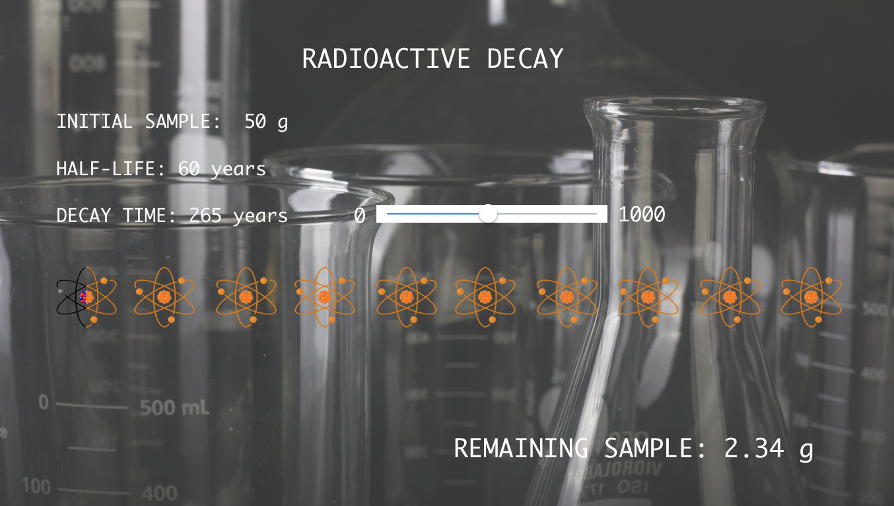
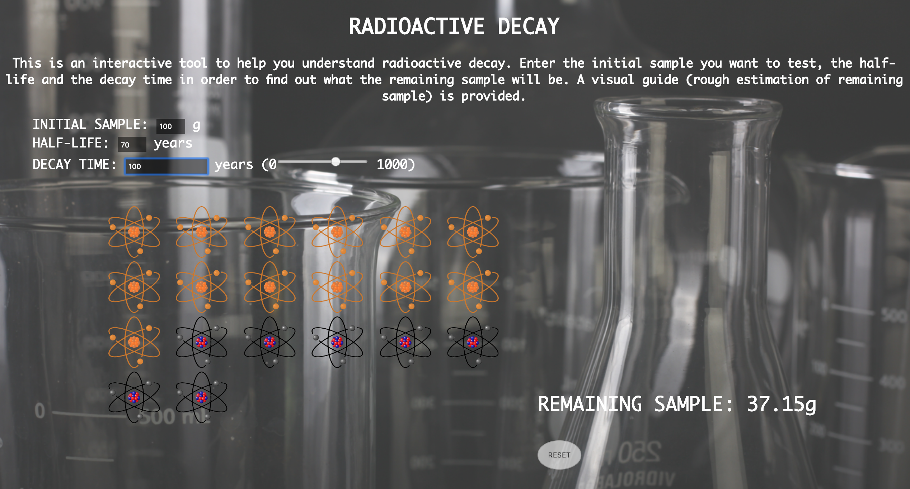

## Smartsparrow code challenge

### Wireframe

* I used Sketch to create a wireframe indicating the UI features I wanted to include and the layout for my application. Although it is not identical to the finished product, it acted as a guide throughout my development process.

  

## How I found the challenge

* Three weeks ago I had never even touched upon topics concerning computer science, and I do not come from a mathematical background what so ever. Hence, things such as logarithmic functions, mathematical constants and log bases are very new to me! That said, I read up on all of these things and from my personal studies over the last few weeks, I have implicated them as best I could.

* I am not proud of the DRYness of my app.js file at all 🙈 - I wanted to concentrate on the logic and I know that I should have written it in a way that I only had to define my constants once at the top of the page, (as I do with all applications I create) but I was having some scope troubles and I though it was more important to get the logic down and do the project in a reasonable amount of time.

* If I had more time, I would look more deeply into the function cycle. As sometimes you have to press enter to get an updated score, and some variations of changes make it update automatically.

* Overall - I am happy with the final product. If I had more time I would have focused on providing a more accurate visual representation of the final sample, i.e. displaying fractions of the remaining atom images rather than rounding to the nearest 5.

## Final product

  

